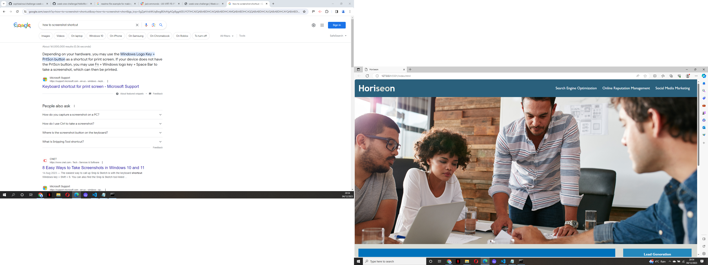

# challenge-week-one

# Description
This project was completed as a marketing company wanted the codebase to follow accesibility standards ensuring their site was optimized for search engines.
I have ensured the source code has semantic HTML elements which follow a logical structure.
The image and icon elements all now contain an accesible "alt" attribute.
During this project I learnt how to add the "alt" elements, how to apply the CSS to sections and how to make the CSS code more concise and easy to follow.

<a href="https://sophieainsw.github.io/challenge-week-one">